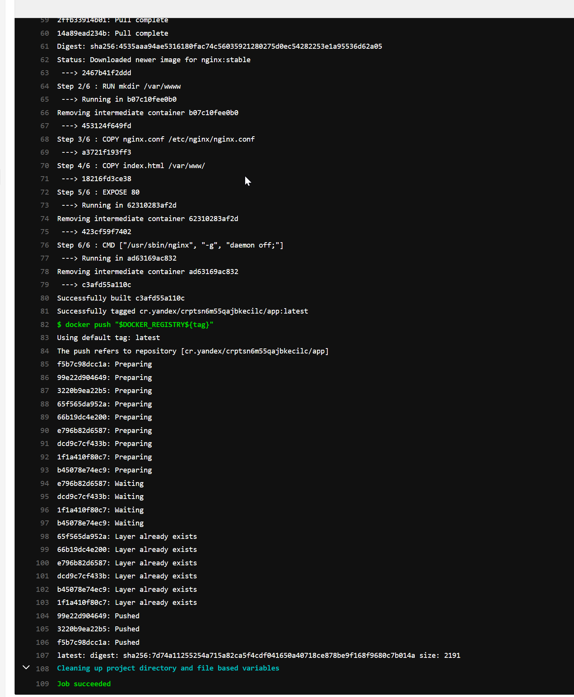
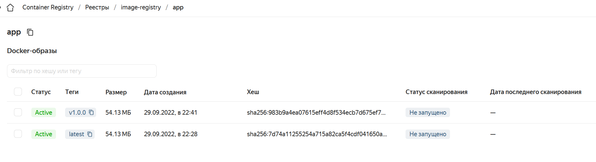

#### Этапы выполнения:

1. Создание облачной инфраструктуры
2. Создание Kubernetes кластера
3. Создание тестового приложения
4. Подготовка cистемы мониторинга и деплой приложения
5. Установка и настройка CI/CD

---
#### Этап 1. Создание облачной инфраструктуры
Используем `Terrafrom` для создания облачной инфраструктуры, а `backend` будем хратить в `Terraform Cloud` (доступен через VPN).

---
##### 1.1 Настройка Terraform Cloud

За основу берем статью по ссылке: https://medium.com/@lichnguyen/using-terraform-workspace-with-terraform-cloud-993c31c1f8bc

Создано вручную два workspace - `alexd-stage` и `alexd-prod` для работы с `backend` `terraform`.


Для того чтобы работать с несколькими `workspace` в `Terraform Cloud` необходимо добавить 
следущий блок в основном `main.tf`:

```
variable "TFC_WORKSPACE_NAME" {
  type = string
  default = ""
}

locals {
  # If your backend is not Terraform Cloud, the value is ${terraform.workspace}
  # otherwise the value retrieved is that of the TFC_WORKSPACE_NAME with trimprefix
  workspace = var.TFC_WORKSPACE_NAME != "" ? trimprefix("${var.TFC_WORKSPACE_NAME}", "alexd-") : "${var.TFC_WORKSPACE_NAME}"
```
А также использование prefix в `versions.tf`:
```
terraform {
  backend "remote" {
    hostname     = "app.terraform.io"
    organization = "alexdies-homework"

    workspaces {
      prefix = "alexd-" 
    }
  }
```
Где `prefix = "alexd-"`- это префикс для определения ранее созданных `workspace` в `TFC`

Используем `token` `TF_TOKEN_app_terraform_io` для подключения к TFC командой `terraform login` 

Создаем `workspace` `prod` и `stage` с помощью команды `terraform workspace new prod` и `terraform workspace new stage`. Переключение осуществляется с помощью команды `terraform workspace select {x}`.

По итогу у нас есть два `workspace` `prod` и `stage`:
```
terraform workspace list
  prod
* stage
```

При запуске `terraform init` хранение `.tfstate` и дальнейшая работа будет происходить в `wokspace alexd-prod` (если выбран `wokspace prod`) или `wokspace alexd-stage` (если выбран `wokspace stage`).

---
##### 1.2. Создание сервисного аккаунта YC для Terraform

##### 1.2.1 Создаем `service account` для `terraform`:

```
yc iam service-account create terraform

id: ajekarlmhnn3srrqn23a
folder_id: b1g8p0oqeo4nim4ua3js
created_at: "2022-09-06T18:28:08.285273034Z"
name: terraform
```

##### 1.2.2 Добавление роли для `service account` `terraform` в стандартный каталог `default`:

Добавим роль `editor` (для созданий ресурсов)

```
yc resource-manager folder add-access-binding default --role editor --subject serviceAccount:ajekarlmhnn3srrqn23a

done (1s)
```
Добавим роль `container-registry.admin` (для создания, изменения и удаления реестра)

```
yc resource-manager folder add-access-binding default --role container-registry.admin --subject serviceAccount:ajekarlmhnn3srrqn23a
done (1s)
```
```
yc resource-manager folder list-access-bindings default
+--------------------------+----------------+----------------------+
|         ROLE ID          |  SUBJECT TYPE  |      SUBJECT ID      |
+--------------------------+----------------+----------------------+
| container-registry.admin | serviceAccount | ajekarlmhnn3srrqn23a |
| editor                   | serviceAccount | ajekarlmhnn3srrqn23a |
+--------------------------+----------------+----------------------+
```
##### 1.2.3 Добавляем к `service account` ключ и записываем его в отдельный файл `key.json`

```
yc iam key create --service-account-id=ajekarlmhnn3srrqn23a --output key.json

id: ajet2k86qmfggj5m9dsu
service_account_id: ajekarlmhnn3srrqn23a
created_at: "2022-09-06T19:14:44.374314518Z"
key_algorithm: RSA_2048
```

##### 1.2.4 Добавить ключ из `key.json` в переменную `YC_SERVICE_ACCOUNT_KEY_FILE` в `TFC` как переменную ENV и делаем её скрытной:

Так как в TFC в ENV окружение переменная должна быть одной строкой, то необходимо убрать все переносы строк, сделать это можно следующей командой:

`tr -d '\n'< key.json > newkey.json`

Далее добавляем переменную `YC_SERVICE_ACCOUNT_KEY_FILE` в категории `Environment variable` и указываем значение из файла `newkey.json`.


---
##### 1.3 Создание k8s инстансов

Инстансы описаны в файле [k8s.tf](Infrastructure/k8s.tf). В зависимости от выбранного `workspace` (`prod` или `stage`) будет создано разное количество control node и worker node, а также разное значение их параметров. 

*P.S. Та как квоты и баланс в YC ограничены - я "порезал" некоторые характеристики в `local `переменных для развертывания. При необходимости эти параметры могут быть заменены под свои значения.*

---
##### 1.4. Создание `Container Registry` и дополнительные `service account`:

Создадим сам `Container Registry` с именем `image-registry`:
```
resource "yandex_container_registry" "image-registry" {
  name = "image-registry"
  folder_id = "b1g8p0oqeo4nim4ua3js"
  labels = {
    my-label = "registry"
  }
}
```
Далее создадим два `service account`:

1) Для `pull` образов (`k8s-sa`) и дальнейшего развертывания в кластере `kubernetes`:
```
resource "yandex_iam_service_account" "k8s-sa" {
  name = "k8s-service-account"
}

# Созадим ключ для доступа к аккаунту k8s
resource "yandex_iam_service_account_key" "k8s-sa-key" {
  service_account_id = yandex_iam_service_account.k8s-sa.id
  description = "k8s-service-account-key"
  depends_on = [
    yandex_iam_service_account.k8s-sa
  ]
}

# Привяжем сервисный аккаунт для k8s к роли для pull образов
resource "yandex_container_registry_iam_binding" "k8s-role-puller" {
  registry_id = yandex_container_registry.image-registry.id
  role = "container-registry.images.puller"
  members = [
    "serviceAccount:${yandex_iam_service_account.k8s-sa.id}"
  ]
  depends_on = [
    yandex_container_registry.image-registry,
    yandex_iam_service_account.k8s-sa,
  ]
}
```
2) Для `push` образов (`ci-cd`) и дальнейшего использования при работе с `CI/CI`
```
resource "yandex_iam_service_account" "ci-cd" {
  name = "ci-ci-service-account"
}

# Созадим ключ для доступа к аккаунту ci-cd
resource "yandex_iam_service_account_key" "ci-cd-key" {
  service_account_id = yandex_iam_service_account.ci-cd.id
  description = "ci-ci-service-account-key"
  depends_on = [
    yandex_iam_service_account.ci-cd
  ]
}

# Привяжем сервисный аккаунт для ci-cd к роли для push образов
resource "yandex_container_registry_iam_binding" "ci-cd-role-pusher" {
  registry_id = yandex_container_registry.image-registry.id
  role = "container-registry.images.pusher"
  members = ["serviceAccount:${yandex_iam_service_account.ci-cd.id}"]
  depends_on = [
    yandex_container_registry.image-registry,
    yandex_iam_service_account.ci-cd,
  ]
}
```
Манифест: [container_registry.tf](Infrastructure/container_registry.tf)

---
##### 1.5. Создание файла `outputs`:

Для того, чтобы видеть какие IP-адреса будут получены на машинах, мы добавим этот параметр в файл [outputs.tf](Infrastructure/outputs.tf). А также добавим дополнительную необходмую нам информацию после развертывания.

В итоге, после развертывания кластера с помощью `Terraform` мы получим инфомрацию:
- О внешних IP-адресах нод
- О внутренних IP-адресах нод
- Адрес созданного репозитория в YC
- Информацию о ключе созданного ранее service account k8s
- Информацию о ключе созданного ранее service account ci-cd

---
##### 1.6. Запускаем развертывание облачной инфраструктруы с помощью Terraform

Для тестовго запуска используем `worksapce` - `stage`.


```
Apply complete! Resources: 0 added, 0 changed, 0 destroyed.

Outputs:

ci-cd-key = <sensitive>
container_registry = "cr.yandex/crptsn6m55qajbkecilc"
k8s-sa-key = <sensitive>
kube_control_plane = [
  "84.252.129.94",
]
kube_control_plane_IP = [
  "192.168.10.10",
]
kube_node = [
  "51.250.75.2",
  "51.250.16.159",
  "51.250.47.159",
]
kube_node_IP = [
  "192.168.10.16",
  "192.168.20.18",
  "192.168.30.32",
]
```
Проверим на `teraform cloud`:


**Всё развернулось успешно!**

После создания новых `service account` необходимо получить значенией их ключей в json формате и сохранить файлы с помощью команд:

`terraform output -json k8s-sa-key > key_k8s.json`

`terraform output -json ci-cd-key > key_ci_cd.json`

Они нужны нам будут далее, пока сохраним.

---
#### Этап 2. Создание Kubernetes кластера

`Kubernetes` кластер будем создавать с помощью `kuberspray` (https://github.com/kubernetes-sigs/kubespray). 
```
P.S.Изначально планировал использовать динамическое создание inventory для Kuberspray используя приложение `terraform-ansible`, но по итогу ничего не вышло.
```

---
##### 2.1. Клонирование репозитория и установка зависимостей для Kuberspray:

Клонируем репозиторий:

        git clone https://github.com/kubernetes-sigs/kubespray
        Cloning into 'kubespray'...
        remote: Enumerating objects: 59138, done.
        remote: Counting objects: 100% (889/889), done.
        remote: Compressing objects: 100% (520/520), done.
        remote: Total 59138 (delta 329), reused 723 (delta 266), pack-reused 58249R
        Receiving objects: 100% (59138/59138), 17.43 MiB | 2.69 MiB/s, done.
        Resolving deltas: 100% (33207/33207), done.

Переходим внутрь папки `kuberspray`. Копируем содержимое папки `kubespray/inventory/sample/`:
`cp -rfp kubespray/inventory/sample/ ansible-kuber-infra/mycluster`

Обновим Ansbile `pip3 install ansible==5.9.0`

Установка зависимостей
`sudo pip3 install -r requirements.txt`

---
##### Подгтовка динамической конфигурации (НЕ ПОЛУЧИЛОСЬ, ПРОПУСТИЛ)
Для формирования динамического inventory для дальнейшей работы с Ansible используем приложение `terraform-ansible` (https://github.com/adammck/terraform-inventory)
```
Скачиваем: 

`wget https://github.com/adammck/terraform-inventory/releases/download/v0.10/terraform-inventory_v0.10_linux_amd64.zip`

Разархивируем:
`unzip terraform-inventory_v0.10_linux_amd64.zip`

Добавляем права и переносим в `/usr/local/bin`:

`chmod 755 terraform-inventory && mv terraform-inventory /usr/local/bin/`

Запускаем `TF_STATE=terraform_state.json ansible-playbook -b --inventory-file=/usr/local/bin/terraform-inventory -i ansible-test/hosts.yaml ansible-test/ping.yaml`

`TF_STATE` - переменная где находится наш terraform state (`terraform show -json > terraform_state.json`)
```

**Итог:** После запуска от `root` возникает ошибка на `play` `aggregate all SANs` в роли `kubeadm-setup.yml`. После изучения проблемы увидел, что по какой-то причине IP адреса переданные с помощью `terraform-ansible` в данном `play` парсятся с ошибкой - добавляется "обрезанный" адрес в формате - `51.` (вместо полноценно X.X.X.X). 

*P.S.Как это победить - не знаю, разобраться, к сожалению, не смог. Решил использовать статический inventory*

---

##### 2.2. Подготовка статического файла `inventory` `host.yml` и `group_vars` для Kuberspray:

Подготовка файла `host.yml`:

Используем `inventory builder` из `kuberspray` на основе полученных `outputs terraform`
```
kube_control_plane = [
  "84.252.129.94",
]

kube_node = [
  "51.250.75.2",
  "51.250.16.159",
  "51.250.47.159",
]
```
```
declare -a IPS=(84.252.129.94, 51.250.75.2, 51.250.16.159, 51.250.47.159)

CONFIG_FILE=../ansible-kuber-infra/mycluster/host1.yml python3 contrib/inventory_builder/inventory.py ${IPS[@]}
DEBUG: Adding group all
DEBUG: Adding group kube_control_plane
DEBUG: Adding group kube_node
DEBUG: Adding group etcd
DEBUG: Adding group k8s_cluster
DEBUG: Adding group calico_rr
DEBUG: adding host node1 to group all
DEBUG: adding host node2 to group all
DEBUG: adding host node3 to group all
DEBUG: adding host node4 to group all
DEBUG: adding host node1 to group etcd
DEBUG: adding host node2 to group etcd
DEBUG: adding host node3 to group etcd
DEBUG: adding host node1 to group kube_control_plane
DEBUG: adding host node2 to group kube_control_plane
DEBUG: adding host node1 to group kube_node
DEBUG: adding host node2 to group kube_node
DEBUG: adding host node3 to group kube_node
DEBUG: adding host node4 to group kube_node
```
Получаем файл `host.yml`. Редактируем его, оставляя `node1` в `kube_control_plane` и в `etcd`, остальные `node2,3,4` остаются в `kube_node`

В разделе `mycluster` ->` group_vars` ->`all` в файле `all.yml` интересует параметр `loadbalancer_apiserver`:
```
    ## External LB example config
    ## apiserver_loadbalancer_domain_name: "elb.some.domain"
    loadbalancer_apiserver:
    address: 84.252.129.94
    port: 6443
```
Устанавливаем внешний IP-адрес `Control Node`.

В `k8s_cluster` -> `addons.yml` устанавлиаем доплнение в виде `ingress nginx`:
```
ingress_nginx_enabled: true
ingress_nginx_namespace: "ingress-nginx"
ingress_nginx_insecure_port: 80
ingress_nginx_secure_port: 443
ingress_nginx_class: nginx
```
Данный addon необходим нам для того, чтобы получить доступ снаружи к нашему приложению и web-интерфейсу `grafana`.

---

##### 2.3. Запуск Kuberspray для развертывания kubernetes cluster

Предварительно, необходимо будет подключиться к каждой созданной VM через `SSH ubuntu@<IP>`, чтобы добавить эти машины в `ssh known_hosts`, иначе Ansible не сможет подключиться к удаленным машинам.


`ansible-playbook --become -u ubuntu -i ansible-kuber-infra/mycluster/host.yml kubespray/cluster.yml -vvv`

```
PLAY RECAP *****************************************************************************************************************************************************lolocalhost                  : ok=3    changed=0    unreachable=0    failed=0    skipped=0    rescued=0    ignored=0
node1                      : ok=669  changed=17   unreachable=0    failed=0    skipped=1231 rescued=0    ignored=4   
node2                      : ok=432  changed=3    unreachable=0    failed=0    skipped=731  rescued=0    ignored=2   
node3                      : ok=432  changed=3    unreachable=0    failed=0    skipped=731  rescued=0    ignored=2   
node4                      : ok=432  changed=3    unreachable=0    failed=0    skipped=731  rescued=0    ignored=2   
```

На `Control Node` переключаемся на пользователя `root`(так как под ним был создан `config` файл для kubernetes). Копируем файл содержимое файла с `Control Node` `cat ~/.kube/config` на локальную машину по пути `~/.kube/config`.

Меняем значение `server: https://lb-apiserver.kubernetes.local:6443` на `server: https://84.252.129.94:6443`(внешний IP-адрес `Control Node`).

Проверяем доступ к кластеру: 

```
alexd@DESKTOP-92FN9PG:~/.kube$ kubectl cluster-info 
Kubernetes control plane is running at https://84.252.129.94:6443

alexd@DESKTOP-92FN9PG:~/.kube$ kubectl get nodes 
NAME    STATUS   ROLES           AGE    VERSION
node1   Ready    control-plane   104m   v1.24.4
node2   Ready    <none>          102m   v1.24.4
node3   Ready    <none>          102m   v1.24.4
node4   Ready    <none>          102m   v1.24.4

alexd@DESKTOP-92FN9PG:~/.kube$ kubectl get pods -A
NAMESPACE     NAME                              READY   STATUS    RESTARTS      AGE
kube-system   calico-node-5b2vg                 1/1     Running   0             101m
kube-system   calico-node-7cp8c                 1/1     Running   0             101m
kube-system   calico-node-bkhs6                 1/1     Running   0             101m
kube-system   calico-node-vfhjf                 1/1     Running   0             101m
kube-system   coredns-74d6c5659f-6ppgf          1/1     Running   0             56m
kube-system   coredns-74d6c5659f-cjxqc          1/1     Running   0             56m
kube-system   dns-autoscaler-59b8867c86-4rbqq   1/1     Running   0             56m
kube-system   kube-apiserver-node1              1/1     Running   1             104m
kube-system   kube-controller-manager-node1     1/1     Running   2 (77m ago)   104m
kube-system   kube-proxy-7ldqw                  1/1     Running   0             102m
kube-system   kube-proxy-grstd                  1/1     Running   0             103m
kube-system   kube-proxy-h9826                  1/1     Running   0             102m
kube-system   kube-proxy-zzj6b                  1/1     Running   0             102m
kube-system   kube-scheduler-node1              1/1     Running   2 (77m ago)   104m
kube-system   nodelocaldns-7rwwb                1/1     Running   0             56m
kube-system   nodelocaldns-bthb5                1/1     Running   0             56m
kube-system   nodelocaldns-p9296                1/1     Running   0             56m
kube-system   nodelocaldns-w9tr4                1/1     Running   0             56m
```
Доступ к кластеру `kubernetes` есть! На этом данный этап завершен.

---

#### Этап 3. Создание тестового приложения

В рамках задания возьмём для использования готовый образ `nginx` со своим файлом конфигурации, который будет "отдавать" статическую страницу с заготовленнным текстом.

Ссылка на репозиторий с приложением: https://gitlab.com/alex1094/superapp/-/tree/main

---
##### 3.1 Подготовка `Dockerfile`:

Подготовим образ с помощью `Dockerfile`:
```
FROM nginx:stable
RUN mkdir /var/wwww
COPY nginx.conf /etc/nginx/nginx.conf
COPY index.html /var/www/
EXPOSE 80 
CMD ["/usr/sbin/nginx", "-g", "daemon off;"]
```
Данный `Dockerfile` создает образ приложения, которое работает на стандартном 80 порту и отдает статический контент.

---
##### 3.2 Сборка и загрузки созданного образа в реестр образов `Yandex Cloud Registry`

Авторизуемся с помощью ранее созданного ключа `key_ci_cd.json` в реестре `cr.yandex/crptsn6m55qajbkecilc`
```
cat key_ci_cd.json | docker login --username json_key --password-stdin cr.yandex/crptsn6m55qajbkecilc

WARNING! Your password will be stored unencrypted in /home/alexd/.docker/config.json.
Configure a credential helper to remove this warning. See
https://docs.docker.com/engine/reference/commandline/login/#credentials-store

Login Succeeded
```
Далее собираем `build` нашего `Dockerfile`:

`docker build . -t cr.yandex/crptsn6m55qajbkecilc/app:latest`

И далее пушим `push` его в реестр:

`docker push cr.yandex/crptsn6m55qajbkecilc/app:latest`
```
The push refers to repository [cr.yandex/crptsn6m55qajbkecilc/app]
f1c58cfe9a2c: Layer already exists
ccf7c6750062: Layer already exists
510af23b3443: Layer already exists
65f565da952a: Layer already exists
66b19dc4e200: Layer already exists
e796b82d6587: Layer already exists
dcd9c7cf433b: Layer already exists 
1f1a410f80c7: Layer already exists
b45078e74ec9: Layer already exists
latest: digest: sha256:26fec4cffb299a457233b361b80e5fae07032469677bd0e5752247e43be4119d size: 2191
```
Скриншот реестра:


Ссылка на реестр: https://console.cloud.yandex.ru/folders/b1g8p0oqeo4nim4ua3js/container-registry/registries/crptsn6m55qajbkecilc/overview/app/image

---
##### 3.3 Проверка работы собранного образа
Проверим работу с помощью `docker` и проброса порта на 80-й порт к `nginx`:
```
 docker run -ti --name testapp1 -p 8030:80 cr.yandex/crptsn6m55qajbkecilc/app:latest
172.17.0.1 - - [25/Sep/2022:15:55:42 +0000] "GET / HTTP/1.1" 200 133 "-" "Mozilla/5.0 (Windows NT 10.0; Win64; x64) AppleWebKit/537.36 (KHTML, like Gecko) Chrome/105.0.0.0 Safari/537.36"
172.17.0.1 - - [25/Sep/2022:15:55:42 +0000] "GET /favicon.ico HTTP/1.1" 404 555 "http://localhost:8030/" "Mozilla/5.0 (Windows NT 10.0; Win64; x64) AppleWebKit/537.36 (KHTML, like Gecko) Chrome/105.0.0.0 Safari/537.36"
```
Всё прошло успешно! Приложение готово, работает и находится в реестре!

---

#### Этап 4. Подготовка cистемы мониторинга и деплой приложения

Для организации системы мониторинга планируется использовать репозиторий `kube-prometheus` (https://github.com/prometheus-operator/kube-prometheus)

Скачаем репозиторитй: `git clone git@github.com:prometheus-operator/kube-prometheus.git `

---
##### 4.1. Развертывание системы мониторинга:

Используем команду: `kubectl apply --server-side -f kube-prometheus/manifests/setup`

```
kubectl apply --server-side -f kube-prometheus/manifests/setup

customresourcedefinition.apiextensions.k8s.io/alertmanagerconfigs.monitoring.coreos.com serverside-applied
customresourcedefinition.apiextensions.k8s.io/alertmanagers.monitoring.coreos.com serverside-applied
customresourcedefinition.apiextensions.k8s.io/podmonitors.monitoring.coreos.com serverside-applied
customresourcedefinition.apiextensions.k8s.io/probes.monitoring.coreos.com serverside-applied
customresourcedefinition.apiextensions.k8s.io/prometheuses.monitoring.coreos.com serverside-applied
customresourcedefinition.apiextensions.k8s.io/prometheusrules.monitoring.coreos.com serverside-applied
customresourcedefinition.apiextensions.k8s.io/servicemonitors.monitoring.coreos.com serverside-applied
customresourcedefinition.apiextensions.k8s.io/thanosrulers.monitoring.coreos.com serverside-applied
namespace/monitoring serverside-applied
```
Далее используем команду: `kubectl wait --for condition=Established --all CustomResourceDefinition --namespace=monitoring`

```
kubectl wait \
--for condition=Established \
 --all CustomResourceDefinition \
 --namespace=monitoring

customresourcedefinition.apiextensions.k8s.io/alertmanagerconfigs.monitoring.coreos.com condition met
customresourcedefinition.apiextensions.k8s.io/alertmanagers.monitoring.coreos.com condition met
customresourcedefinition.apiextensions.k8s.io/bgpconfigurations.crd.projectcalico.org condition met
customresourcedefinition.apiextensions.k8s.io/bgppeers.crd.projectcalico.org condition met
customresourcedefinition.apiextensions.k8s.io/blockaffinities.crd.projectcalico.org condition met
customresourcedefinition.apiextensions.k8s.io/caliconodestatuses.crd.projectcalico.org condition met
customresourcedefinition.apiextensions.k8s.io/clusterinformations.crd.projectcalico.org condition met
customresourcedefinition.apiextensions.k8s.io/felixconfigurations.crd.projectcalico.org condition met
customresourcedefinition.apiextensions.k8s.io/globalnetworkpolicies.crd.projectcalico.org condition met
customresourcedefinition.apiextensions.k8s.io/globalnetworksets.crd.projectcalico.org condition met
customresourcedefinition.apiextensions.k8s.io/hostendpoints.crd.projectcalico.org condition met
customresourcedefinition.apiextensions.k8s.io/ipamblocks.crd.projectcalico.org condition met
customresourcedefinition.apiextensions.k8s.io/ipamconfigs.crd.projectcalico.org condition met
customresourcedefinition.apiextensions.k8s.io/ipamhandles.crd.projectcalico.org condition met
customresourcedefinition.apiextensions.k8s.io/ippools.crd.projectcalico.org condition met
customresourcedefinition.apiextensions.k8s.io/ipreservations.crd.projectcalico.org condition met
customresourcedefinition.apiextensions.k8s.io/kubecontrollersconfigurations.crd.projectcalico.org condition met
customresourcedefinition.apiextensions.k8s.io/networkpolicies.crd.projectcalico.org condition met
customresourcedefinition.apiextensions.k8s.io/networksets.crd.projectcalico.org condition met
customresourcedefinition.apiextensions.k8s.io/podmonitors.monitoring.coreos.com condition met
customresourcedefinition.apiextensions.k8s.io/probes.monitoring.coreos.com condition met
customresourcedefinition.apiextensions.k8s.io/prometheuses.monitoring.coreos.com condition met
customresourcedefinition.apiextensions.k8s.io/prometheusrules.monitoring.coreos.com condition met
customresourcedefinition.apiextensions.k8s.io/servicemonitors.monitoring.coreos.com condition met
customresourcedefinition.apiextensions.k8s.io/thanosrulers.monitoring.coreos.com condition met
```
Применяем манифесты командой: `kubectl apply --server-side -f kube-prometheus/manifests/`
```
kubectl apply --server-side -f kube-prometheus/manifests/

alertmanager.monitoring.coreos.com/main serverside-applied
networkpolicy.networking.k8s.io/alertmanager-main serverside-applied
poddisruptionbudget.policy/alertmanager-main serverside-applied
prometheusrule.monitoring.coreos.com/alertmanager-main-rules serverside-applied
secret/alertmanager-main serverside-applied
service/alertmanager-main serverside-applied
serviceaccount/alertmanager-main serverside-applied
servicemonitor.monitoring.coreos.com/alertmanager-main serverside-applied
```
Проверяем установленную систему мониторинга:

```
alexd@DESKTOP-92FN9PG:/mnt/c/Users/AlexD/Documents/VSCodeProject/Diplom/Infrastructure$ kubectl get pods -n monitoring -o wide

NAME                                   READY   STATUS    RESTARTS      AGE     IP              NODE    NOMINATED NODE   READINESS GATES
alertmanager-main-0                    2/2     Running   1 (82s ago)   101s    10.233.75.3     node2   <none>           <none>
alertmanager-main-1                    2/2     Running   1 (38s ago)   101s    10.233.71.5     node3   <none>           <none>
alertmanager-main-2                    2/2     Running   0             101s    10.233.74.68    node4   <none>           <none>
blackbox-exporter-69684688c9-mtrmm     3/3     Running   0             2m13s   10.233.71.2     node3   <none>           <none>
grafana-86c5bb4f94-zblt5               1/1     Running   0             2m11s   10.233.71.3     node3   <none>           <none>
kube-state-metrics-d75597b45-7clkg     3/3     Running   0             2m10s   10.233.75.2     node2   <none>           <none>
node-exporter-45p4x                    2/2     Running   0             2m9s    192.168.20.18   node2   <none>           <none>
node-exporter-6zxx4                    2/2     Running   0             2m9s    192.168.10.10   node1   <none>           <none>
node-exporter-j5zw7                    2/2     Running   0             2m9s    192.168.30.32   node4   <none>           <none>
node-exporter-nv9tz                    2/2     Running   0             2m9s    192.168.10.16   node3   <none>           <none>
prometheus-adapter-678b454b8b-fqcgk    1/1     Running   0             2m7s    10.233.74.66    node4   <none>           <none>
prometheus-adapter-678b454b8b-t89x2    1/1     Running   0             2m7s    10.233.71.4     node3   <none>           <none>
prometheus-k8s-0                       2/2     Running   0             100s    10.233.75.4     node2   <none>           <none>
prometheus-k8s-1                       1/2     Running   0             100s    10.233.71.6     node3   <none>           <none>
prometheus-operator-748bb6fccf-xsgv7   2/2     Running   0             2m6s    10.233.74.67    node4   <none>           <none>
```
---
##### 4.2. Настройка Grafana:
Проверим доступность Grafana:
```
POD=$(kubectl get pods --namespace=monitoring | grep grafana| cut -d ' ' -f 1)
```
```
kubectl port-forward $POD --namespace=monitoring 3000:3000

Forwarding from 127.0.0.1:3000 -> 3000
Forwarding from [::1]:3000 -> 3000
Handling connection for 3000
Handling connection for 3000
```
Поменяем стандартный пароль (по умолчаниюя `admin\admin`):

`login: admin`
`password: password`

Выберем `Dashboard` для нашего кластера из загруженных `default`:


---
##### 4.3. Подготовка манифестов для развертывания приложения:

- Подготовим [deployment](kuber/deployment.yaml) для приложения


- Подготовим [namespace](kuber/namespace.yaml) для приложения

- Подготовим [secret](kuber/secret.yaml) для доступа к реестру образов в `Yandex Cloud Registry`

Первоначально подключим авторизацию по ключу от сервисного аккаунта `key_k8s.json` созданному ранее с помощью `Terraform`. Для этого необходимо залогинеться с помощью данного ключа в `docker`:
```
 cat key_k8s.json | docker login --username json_key --password-stdin cr.yandex/crptsn6m55qajbkecilc
```
Зашифруем файл `~/.docker/config.json`:
```
cat ~/.docker/config.json | base64

ewogICJhdXRocyI6IHsKICAgICJjci55YW5kZXgiOiB7CiAgICAgICJhdXRoIjogImFuTnZibDly
WlhrNmV5SmpjbVZoZEdWa1gyRjBJam9pTWpBeU1pMHdPUzB4TjFReE5Ub3dNem93TTFvaUxDSnBa
Q0k2SW1GcVpYSjBaemRuWWpSdVpqY3liV3cwYm1nMElpd2lhMlY1WDJGc1oyOXlhWFJvYlNJNkls
SlRRVjh5TURRNElpd2ljSEpwZG1GMFpWOXJa -----------

```
Далее будем использовать `.dockerconfigjson` для авторизации в YC Conteiner Registry в `kubernetes` `secret` для дальнейшего пула образов.


- Подготовим [service](kuber/service.yaml) для нашего приложения

- Подготовим [ingress](kuber/ingress.yaml) для доступа к приложению извне и к web-интерфейсу `grafana`

По умолчанию создается `networkpolicies` для `grafana`, которая не позволяет получить доступ извне. Удалим её командой: `kubectl -n monitoring delete networkpolicies.networking.k8s.io grafana`

---

##### 4.4. Развернем все манифесты и проверим доступность приложения и grafana извне:

После применения всех манифестов, необходимо проверить доступность приложения извне, а также доступность web-интерфейса `grafana`.

1) Проверим доступность к web-интерфейсу приложения. Ранее мы создали `Ingress` привязанный к `service appservice` нашего приложения с обращением по `host` `app.demo.ru`. Пропишет данный адрес в локальном файле `hosts` и проверим в браузере:


2) Проверим доступность к web-интерфейсу `grafana`. Ранее мы создали `Ingress` привязанный к `service grafana-ingress` с обращением по `host` `grafana.demo.ru`. Пропишет данный адрес в локальном файле `hosts` и проверим в браузере:
   


Ссылка на репозиторий с манифестами приложения: https://github.com/AlexDies/DipIomInfrastructure/tree/master/kuber

**Всё готово, данный этап завершен!**

---
#### Этап 5. Установка и настройка CI/CD

Для работы с CI/CD будем использовать `Gitlab CI/CD` и внешний репозиторий на `YandexCloud` (`cr.yandex/crptsn6m55qajbkecilc/app)`.

Инструментом для `Deploy` будет выступать `Helm`.

----
##### 5.1. Добавление сервисного аккаунта YC в Gitlab для авторизации в приватном репозитории YandexCloud:

Чтобы `Gitlab CI/CD` смог получить доступ к нашему репозиторию на `YandexCloud` (`cr.yandex/crptsn6m55qajbkecilc/app)`, нам необходимо добавить ранее созданный сервисный аккаунт с помощью `Terraform` из `key_ci_cd.json` в переменную Gitlab.


Для начала преобразуем файл `key_ci_cd.json` в `base64`: `cat ./key_ci_cd.json | base64`. 

Далее полученный результат сохраним в переменной Gitlab: `Settings` -> `CI/CD` -> `Variables`. Добавим новый ключ `Add variable` -> `key: key_ci_cd`, `value: значение полученное ранее`, `type: Variable`.


---
##### 5.2 Создание service account для доступа к кластеру kubernetes с нужными правами в CI/CD и создание переменной KUBECONFIG.

Так как выполнение deploy будет осуществляться из CI/CD посредством `Helm`, то необходим доступ к нашему кластеру `kubernetes`. 

Нельзя предоставлять доступ ко всему кластеру в роли стандартного пользователя `kubernetes-admin`. Необходимо создать отдельный аккаунт с нужными правами.

##### 5.2.1 Создание нового service account и добавление нужных прав для работы в кластере kubernetes.

Создаем `service account` `deployer` и `secret token` `deploye-secret` для данного аккаунта следующим манифестом: [account.yaml](kuber/RBAC/account.yaml)

Далее создаем `Cluster Role` `deployer` (приложение может быть в разных namespace, отсюда нам необходима именно cluster role, а не просто role) с нужными нам правами для деплоя нашего приложения. 
Описание манифеста: [role.yaml](kuber/RBAC/role.yaml)

После привяжем наш созданный `service account` `deployer` к `Cluster Role` `deployer` создав `ClusterRoleBinding` `deployer-rb`. 
Описание манифеста: [role-binding.yaml](kuber/RBAC/role-binding.yaml)

##### 5.2.2 Добавление нового user в context нашего кластера на основе созданного ранее service account.

Подаем команду `kubectl get secrets deploye-secret -o yaml`, находим значение `token` и далее расшифровываем его с использованием base64 и сохраняем в переменную `TOKEN`: 

```
TOKEN=$(echo <ZXlKaGJHY2lPa-----> | base64 -d)
```

Устанавливаем настройки для `user` `deployer-ci` и сохраненного ранее `TOKEN` командой:
```
kubectl config set-credentials deployer-ci --token=$TOKEN
```
Далее устанавливает текущий `context` и переключаемся на созданного ранее `user` `deployer-ci` командой:

```
kubectl config set-context --current --user=deployer-ci
Context "kubernetes-admin@cluster.local" modified.
```

##### 5.2.3 Добавление переменной KUBECONFIG в переменную GitLab CI\CD

Открываем наш файл конифгурации `~/.kube/config`, копируем текущие настройки кластера и поле с `user` `deployer-ci`. Далее полученный результат сохраним в переменной Gitlab: `Settings` -> `CI/CD` -> `Variables`. Добавим новый ключ `Add variable` -> `key: KUBECONFIG`, `value: значение полученное ранее`, `type: File`.

---
##### 5.3 Сознание Helm chart нашего приложения

Созданные ранее манифесты для развертывания нашего приложения преобразуем в `Helm chart` `superapp` для дальнейшего `deploy` в наш кластер `kubernetes`.

`Helm chart` доступен по ссылке: https://gitlab.com/alex1094/superapp/-/tree/main/helmDeploy/superapp


Также нам необходима переменная содержащая значение `dockerconfigjson` для нашего файла `values.yaml` нашего `helm chart` `superapp` в CI/CD. 

Добавим переменную `DOCKER_CONFIG_JSON` и укажем значение переменной `dockerconfigjson` полученного ранее в `п.4.3`

---

##### 5.4 Создание Pipeline в CI/CD.

Подготовим файл `.gitlab-ci.yml` для pipeline.

В нашем Pipeline у нас будет 2 этапа: `build` и `deploy`

1) Этап `build` - собирает (build) docker-образ из `Dockerfile` с нашим приложением при любом коммите в репозиторий или при добавлении `tag`. 
Далее загружает(push) данный образ в репозиторий `cr.yandex/crptsn6m55qajbkecilc/app` выставляя нужный `tag` (на основе ветки с которой идет коммент или же тега).
```
docker-build:
  variables:
    DOCKER_REGISTRY: "cr.yandex/crptsn6m55qajbkecilc/app"

  # Use the official docker image.
  image: docker:latest
  stage: build
  services:
    - docker:dind
  before_script:
    - echo "$key_ci_cd" | base64 -d > key_ci.json
    - cat key_ci.json | docker login --username json_key --password-stdin $DOCKER_REGISTRY
  # Default branch leaves tag empty (= latest tag)
  # All other branches are tagged with the escaped branch name (commit ref slug)
  script:
    - |
      if [[ "$CI_COMMIT_BRANCH" == "$CI_DEFAULT_BRANCH" ]]; then
        tag=""
        echo "Running on default branch '$CI_DEFAULT_BRANCH': tag = 'latest'"
      else
        tag=":$CI_COMMIT_REF_SLUG"
        echo "Running on branch '$CI_COMMIT_BRANCH': tag = $tag"
      fi
      if [[ $CI_COMMIT_TAG != "" ]]; then
        tag=":$CI_COMMIT_TAG"
        echo "Running on tag '$CI_COMMIT_TAG': tag = $tag"
      fi      
    - docker build -t "$DOCKER_REGISTRY${tag}" .
    - docker push "$DOCKER_REGISTRY${tag}" 
```

За основу берем обычный образ `docker`. На данном этапе мы используем ранее добавленную переменну `$key_ci_cd` для авторизации `docker` в `yc Container Registry`. 

2) Этап `deploy` - при добавлении `tag`, осуществляется дальнейший `deploy` нашего приложения с помощью `Helm` в наш кластер используя созданный ранее образ приложения из `yc Container Registry`

```
deploy-helm:
  stage: deploy
  image: 
    name: alpine/helm:latest
    entrypoint: ["/bin/sh", "-c"]
  script:
    - |
      if [[ $CI_COMMIT_TAG != "" ]]; then
        tag="$CI_COMMIT_TAG"
        echo "Running on tag '$CI_COMMIT_TAG': tag = $tag"
      fi          
    # Setting up kubeconfig
    - export KUBECONFIG=${KUBECONFIG}
    # Deploy via Helm
    - cd helmDeploy
    - helm upgrade --install --set dockerconfigjson=${DOCKER_CONFIG_JSON},image.tag=$tag application superapp
  rules:
    - if: $CI_COMMIT_TAG
    - when: never  
```
За основу берем обычный образ `alpine/helm:latest`, так как в нём по умолчанию установлен `helm`. 
На данном этапе мы используем ранее добавленную переменную `$DOCKER_CONFIG_JSON` для создания `secret cr.ya.pull` нашего приложения из `Helm chart` (для pull образа приложения из приватного репозитория используя специальный сервисный аккаунт).

А также используем добавленную ранее переменную `$KUBECONFIG` в которой указан файл для подключения к нашему кластеру под специальным `user` с нужными правами.

Переменные в нашем CI/CD:


Ссылка на `.gitlab-ci.yml`: https://gitlab.com/alex1094/superapp/-/blob/main/.gitlab-ci.yml

---
##### 5.4 Проверим работу нашего Pipeline в CI/CD.

Репозиторий с приложением, `.gitlab-ci.yml` и нашим `helm chart` доступен по ссылке: https://gitlab.com/alex1094/superapp/-/tree/main

---
##### 5.4.1 Добавим произвольный коммит в наш репозиторий и проверим работу CI

В репозитории с нашим приложением добавим коммит `test_commit`. После этого начнется автоматическая сборка docker-образа с нашим приложением и `push` этого образа в приватный реестр Yandex Cloud:


Билд прошел успешно:



В реестр YC созданный образ добавлен успешно:


##### 5.4.2 Добавим произвольный tag в наш репозиторий и проверим работу CD

В репозитории с нашим приложением добавим `tag` `v1.0.0`. После этого начнется автоматическая сборка docker-образа с нашим приложением и `push` этого образа в приватный реестр Yandex Cloud с меткой `v1.0.0`. Далее запустится второй этап - `deploy` нашего приложения в кластер kubernetes используя созданный docker-образ.


Этап `build` прошел успешно, образ `tag` `v1.0.0` собран и загружен в реестр


Этап `deploy` прошел успешно:


Весь процесс CI/CD прошел успешно:


Проверим обновленный реестр YC:


Ссылка на приватный репозиторий YC: https://console.cloud.yandex.ru/folders/b1g8p0oqeo4nim4ua3js/container-registry/registries/crptsn6m55qajbkecilc/overview/app/image


Проверим развернутое приложение в кластере:
```
helm list

WARNING: Kubernetes configuration file is group-readable. This is insecure. Location: /home/alexd/.kube/config
WARNING: Kubernetes configuration file is world-readable. This is insecure. Location: /home/alexd/.kube/config
NAME            NAMESPACE       REVISION        UPDATED                                 STATUS          CHART           APP VERSION
application     default         18              2022-09-29 19:41:24.480097501 +0000 UTC deployed        superapp-0.1.0  1.16.0
```
---
##### 5.5 Проверим работу нашего ПО и доступ к Grafana

Проверяем доступ к ПО снаружи, обращаясь по адресу `http://app.demo.ru/`


Проверяем доступ к `grafana` снаружи, обращаясь по адресу `http://grafana.demo.ru/`


**По итогу: Всё работае и готово!**

